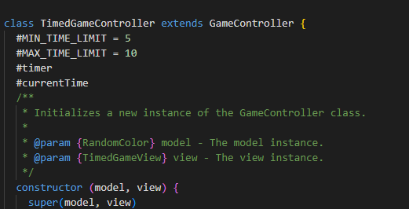

# Reflektion

## Kapitel 2: Meaningful Names
Förmodligen det kapitlet och regler som jag tänker på mest när jag skriver kod. Jag försöker verkligen följa de reglerna som kapitlet tar upp, kanske främst "Use Intention-Revealing Names". Ibland kan det dock bli svårt om namnen blir för långa och på så sätt gör koden mindre inbjudande att läsa om kodrader blir för långa. En regel jag tog upp i min Laboration 2 reflektion var "Avoid Disinformation" som jag ansåg jag bröt mot vid ett tillfälle i min modul. Det har jag nu åtgärdat genom att ändra namn på "generateRandomRGBColor" metoden till "generateRandomRGBString" för att verkligen berätta vad man får ut av metoden.

## Kapitel 3: Functions
Jag försökte lägga extra fokus på reglerna "Do One Thing" och "Small!" när jag skrev mina metoder. Oftast tycker jag att lyckades bryta ut all kod ganska bra men jag har nog en del metoder där jag säkert kunnat göra ett ännu bättre jobb. Dock började det kännas lite "onödigt" i vissa fall då det bara bidrog till mer scrollande i klassen när man egentligen bröt ut vad jag själv ansåg vara ganska simpel kod. Självklart en avvägning som behöver göras, bara för att jag förstår ett kodstycke betyder det inte att en annan programmerare gör det lika lätt eller snabbt. Lite svårt i vissa fall att avgöra vad "One thing" är tycker jag, till exempel "startGame()" i min "TimedGameController" klass. Den metoden startar spelet men sätter också en "Time limit" som är unik för det spelläget. Kanske skulle jag brytit ut det till en egen metod vid namn: setTimeLimit(). I övrigt tycker jag att bland annat min "ColorThemeView" klass är ett bra exempel på de här två reglerna jag nämnde.

## Kapitel 4: Comments
Här har jag verkligen arbetat på två olika sätt i mina projekt. Min modul är full av jsdoc kommentarer varav vissa verkligen är långa och redundanta, men det ska ändå sägas att boken tycker det är okej att ha med om man skriver ett publikt API. För det mesta fyller jsdoc kommentarerna i min modul en nyttig funktion för andra programmerare som vill använda min modul. Hade jag själv fått bestämma hade jag nog ändå tagit bort några jsdoc kommentarer från vissa metoder i modulen, men jag använde en kodstandard där man var tvungen att skriva jsdoc till alla funktioner. Trots att det är ett publikt API så bryter det mot Clean Codes "Mandated Comments" regel, det blir för mycket klutter och man borde ta bort jsdoc kommentarer på metoder där man använt regeln "Explain Yourself in Code". Vilket jag verkligen försökte göra i min Laboration 3 applikation, där har jag nästan inga kommentarer alls då jag tycker min namngivning på variabler och metoder gör ett bra jobb med att förklara vad koden gör.

Här i min StartController class använde jag mig av en JSdoc kommentar då jag ville beskriva vilken typ av event det handlade om men på de resten av metoderna tycket jag inte det behövdes någon ytterligare förklaring.

## Kapitel 5: Formatting
Jag har försökt tänka på att ha metoder som blir kallade inuti en annan metod så nära varandra som det går i mina klasser, detta tas upp i reglen "Vertical Distance". Det jag tyckte var svårt var när en metod kallade på flera metoder, där en metod i sin tur kallade på ytterligare en metod inuti sig. Hur ska det prioriteras då? (Om du förstår vad jag menar) En annan regel som jag alltid försöker ha i åtanke är "Vertical openness Between Concepts". Jag tycker om att försöka "dela" upp min kod för att på så sätt skapa en tydlighet vad som behandlas var och göra det enkalre att läsa/förstå koden. Ett exempel skulle kanske kunna vara i min "setupEventListeners" metod där koden handlar om samma sak. Trots det är den uppdelad med hjälp av blankrader så det ska bli tydligt att se vilka element som får vilken event lyssnare.

** Nu när jag skriver min reflektion inser jag attt jag inte varit konsekvent i det här kodexemplet i var jag tilldelar event. Hinner dock inte gå in och göra ändringar i koden just nu, kanske hinner innan deadline men screenshotten får vara densamma. **

## Kapitel 6: Objects and Data Structures
I mitt projekt har jag så gott jag kan försökt att kapsla in min kod med privata fält, till exempel "#rgbStringofColor" i "RandomColor" klassen, för att skydda den mot oönskade förändringar från andra klasser. Genom att följa "Hiding Structure" principen har jag försökt se till att mina objekt döljer sin interna struktur. Istället för att fråga objekt om deras data, berättar jag för dem vad de ska göra. Även om jag har en getter i "RandomColor" klassen, vilket kan ifrågasättas, är dens syfte att tillåta kontrollerad åtkomst till objektets data snarare än att avslöja dens interna detaljer. Jag vet att jag i tidgare projekt har utfört så kallade "train wrecks" då jag tänkt att det varit smidigt att bara kalla massa metoder efter varandra, men nu inser jag vikten av att undvika detta för att hålla koden ren och läsbar.

## Kapitel 7: Error Handling
I min Laboration 3 applikation använder jag mig inte av någon felhantering då jag inte riktigt visste vart det skulle behövas eller hur jag skulle implementera det. En tanke kanske skulle kunna vara i samband med att man hämtar en spelares "bestScore" från local storage? Santidigt har jag en liten check som resulterar i att "bestScore" blir 0 ifall en användare inte har "bestScore" ännu i local storage, kanske att det bryter mot "Use Exceptions Rather Than Return Codes"? Jag är ltie osäker på den här delen. Min modul innehåller däremot mängder av validerings metoder för att se till att den fungerar som den ska. Där använder jag mig verkligen av nyss nämnda regel, nedan följer ett av många möjliga exempel.

## Kapitel 8: Boundaries
Jag är inte så säker på att jag tänkt så mycket på detta kapitel när jag skrivit min kod om jag ska vara ärlig. Jag har integrerat tredjepartskod ("Using Third-Party Code") men då det är min modul så har jag från start förstått hur den koden/modulen fungerar och vad man kan göra respektive inte göra. Skulle jag använt mig av ytterligare moduler som jag inte haft tidigare erfaremhet av så är så kallade "Learning Tests" som Clean Code tar upp ett bra sätt att sätta sig in i tredjepartskod. Kanske skulle jag skrivt några sådana tester till min applikation trots jag hade kunskap om min modul bara för att verkligen verifiera att modulen fungerar som jag tänkt. Under rubriken "Learning Tests Are Better Than Free" står det att speciellt vid uppdateringar av modulen är det bra att ha de här testerna.

Osäker på vad för bild jag ska visa här. Här använder jag mig av min modul vilket är tredjepartskod.

## Kapitel 9: Unit tests
För testningen av min Laboration 3 använde jag mig av manuell testning men för min modul använde jag mig av automatiserade enhetstester. När jag skrev testerna hade jag inte läst kapitlet om tester ännu och jag är inte så insatt i automatisk testning överlag. Testerna följer "F.I.R.S.T" reglerna och jag försökte tänka på att vara beskrivande när jag skrev testerna, dels för min egen skull men också för andra programmerare som vill läsa dem.

## Kapitel 10: Classes
 Jag har försökt hålla alla klasser någorlunda små och följa regeln "Classes Should be Small". Jag tycker ändå jag lyckats någorlunda, men min "GameController" klass börjar närma sig en storlek där jag kanske måste börja bryta upp den. Jag har försökt dela upp mina klasser och tänka på "The Single Responsibility Principle", mina vyer tar bara hand om det användarna ser till exempel. Klasserna är alla organiserade på samma sätt med privata fält överst följt av konstruktor och sedan publika metoder. Nedan följer ett exempel på min RandomColor klass från min Modell.

 ## Kapitel 11: System
 Jag har använt mig av MVC mönstret för att organisra min kod/mitt system. Genom att bryta ner koden i modell, kontroller och vyer så har jag försökt att hålla varje del fokuserad på sin specifika uppgift. Vyer står för det användaren ser, modellen hämtar datan från  min modul, kontrollerna tar emot input från användare via vyn och berbetar denna (användarnas svar till exempel). Genom att använda MVC mönstret har jag märkt att det varit ganska lätt att göra förändringar eller lägga till saker till koden. Osäker på om jag förstått rätt vad som ska skrivas under denna rubriken.

 